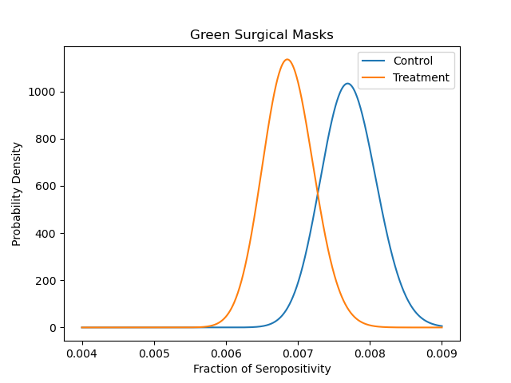
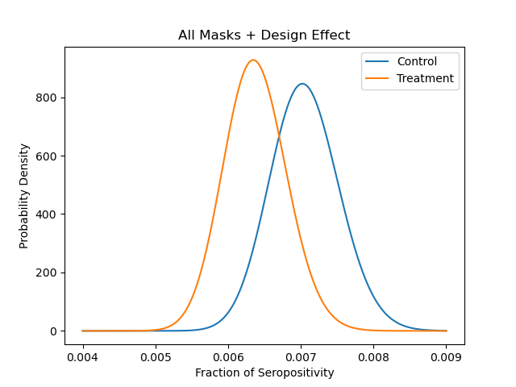

# Thoughts on the Bangladesh Mask Paper

I was asked for my thoughts on the ''Bangladesh Mask Paper" - [The Impact of Community Masking on COVID-19: A Cluster-Randomized Trial in Bangladesh](https://www.poverty-action.org/sites/default/files/publications/Mask_Second_Stage_Paper_20211108.pdf.pdf). Here's my take on it.

I think as far as talking about t-tests, z-scores, and p-values and the effects of cluster randomization, the blog posts and paper by Ben Recht do a better job than I'd hope to do.  I'd use those as the gold standard at evaluating this paper.

[Relative risk is more informative than effectiveness. &#8211; arg min blog](http://www.argmin.net/2021/08/13/relative-risk/)

[The cult of statistical significance and the Bangladesh Mask RCT. &#8211; arg min blog](http://www.argmin.net/2021/11/29/cluster-power/)

[What were the effects of the Bangladesh mask intervention? &#8211; arg min blog](http://www.argmin.net/2021/12/01/unblinding/)

https://arxiv.org/pdf/2112.01296.pdf

**Update: [here’s an interview](https://rumble.com/v11453u-interview-with-mike-deskevich-on-the-bangladesh-mask-study.html) I did with Steve Kirsch about this topic**

## Basic Idea of the Bangladesh Study

The researchers who did the Bangladesh study took about 300,000 people from about 600 villages, randomized them into groups that got no treatment (Control), surgical masks (Green or Blue), or cloth masks (Purple or Red).  I'm not sure what the color change was measuring (cultural attitudes towards color?) or if that's what they used to identify compliance later. The randomization was on the village level. That is, an entire viliage was chosen to be in one of the groups, not individuals within the village (this will be important later).

For the next 9 weeks they had folks monitor mask compliance in these villages and perform two surveys (at the midpoint and end of study) to collect health data (ask if they had COVID symptoms as defined by the WHO).  After the last survey, they asked anyone who had symptoms to do a blood test to look for COVID antibodies.  

The goal was to compare the prevalence of antibodies in the population and deduce if mask wearing had an effect. The actual results are "does mask wearing have an effect on the fraction of population who have symptoms and subsequently test positve for COVID antibodies."  It doesn't answer the question "does mask wearing reduce the prevalence of COVID in the population" which I think is the better thing to be looking at. This is a classic example of the drunk looking for his keys under the street lamp because that’s where the light is.  They did an easier and meaningless study and didn’t put the effort into answering a real public health question.

## Basic Results

As I said, Ben does a much deeper dive into this in the above links, and it would be a waste of time for me to reproduce them here.  I do want to draw some figures to help get an more intuitive idea about what's happening here.  There's no need to get into a t-test, z-score, p-value fight here - looking at probability distributions can give you a gut feeling to understand what's going on.

Below, I plot probability distributions based on a beta distribution. For binary results (postive or negative on COVID antibodies), the beta distribution is a natural choice and better than the Gaussian model they use. (I know, I know, law-of-large-numbers and all of that, but for binary results, why not use the right distribution anyway?) In this first plot, we show the results of "all" of the data.  That is, the treatment group is anyone who got a mask and the control group are the "paired" villages that did not get any masks.

Looking at this, you can make the argument that there is a "statistical" difference since the distributions don't overlap much.  But the actual difference is maybe 1 person in a 1000 (6 in a 1000 with a mask vs 7 in a 1000 without) that contracted COVID because the *entire village* was given masks. And that doesn’t take into account shot noise or testing errors.

**Strike 1: Using this metric it may be statistically significant, but it’s not practically significant and doesn’t take into account any downsides of mask wearing.**

We can also look at the same plot for specific treatments.  

It appears in all subsets except purple that there is some (statistical) effect, but still a negligible effect size.  For some reason, purple masks don't work. I'll keep that in mind next time I'm buying masks.  Seriously though, my interpretation on color differences is that it gives us an idea of the underlying noise that's not captured in the model. Because the material should behave the same (unless there's some cultural obsession with purple that I don't know about), we'd expect the color to have no effect, therefore the size any effect should be attributed to noise and should be added to the model.  Looking at the spread between mask colors of the same mask material gives you an idea of how much uncerainty there is in the study that hasn't been captured by the model.

**Strike 2: Even though in their preregistered study, they don’t plan to look at color differences, they still collect the data and that data does have value in giving us insight into the noise…which they ignore.**

## Cluster Randomization Issues

As Ben talks about in his blog post, there are issues with the analysis because of cluster randomization.  That is, rather than randomizing the treatment among individuals, they randomize the treatment among villages.  That makes sense because you need everyone in the village doing something to measure an effect.  But because of that clustering, the people in the village are not independent: there is correlation within a village.  We account for that with the *Design Effect (DE)* that reduces the effective sample size.  Ben describes how this works in his blog post, and we follow the same thing here by including the DE with the beta distribution.  This has the effect of spreading out the probability distribution, making the results less statistically significant. I can't look at any of these plots and say in good faith that any treatment is statistically significant.

**Strike 3:  They don’t account for basic correlation in their study.  The first question you ask yourself about samples is “are they independent?”  Of course people within a village during a respiratory virus outbreak are not indedependent!**

## Sample Size Issues

I have a hard time with this statement: we enrolled 300,000 people into our study and then tested about 10,000 of them for COVID antibodies and then use the fraction of the 10,000 that were positive to extrapolate back to the population. Maybe it's all valid and I'm worrying about nothing, but if we only tested 10,000 people then the variance we use for our t-, z-, and p- values should be based off of 10,000 subjects, not 300,000 subjects.  Going all the way back to 300,000 subjects means that we're assuming zero seroprevalance everywhere that we didn't test and that just doesn't feel right. They have artificially increased the power of the study by assuming n was 300,000 not 10,000 (and for those who know that power roughly increases with the square root they artificially increased the power of their study by 1000x)

The authors discuss this issue in their paper by limiting their study to "the effect of mask wearing on symptomatic seroprevalance" but that feels like an excuse to continue with the study, rather than answering a practical question.  That is, they chose to answer an easier (and I think meaningless) question because it was something they *could* do rather than designing a more ambitious study that would answer a more useful question.

Below here are the same plots, but with the number of subjects based off the number of people who were tested, not the entire population (also includes the DE issue from above).  These are also the most conservative (in favor of the authors) plots I could make. In all cases, the N for treatment and control were from the 10,000 tested (see table S2 in the original paper), rather than taking even smaller subsets for the different kinds of masks.  I couldn't easily parse their data to pull that out, and with this more conservative approach we lose all statistical significance anyway.

Note, that the x-axis here is the fraction of *symptomatic people who were tested* who were positive, not the fraction of the entire population who were positive. I'm also not super happy doing this because they only tested symptomatic people, so these plots would be biased if masks strongly prevented any symptoms.

One thing this does show is that *if you get symptoms*, you have the same probability of being positive regardless of whether or not your community wears masks. So one way to interpret this is that wearing masks prevents the spread of COVID-like symptoms (which could also be from the flu because it is droplet-spread and a mask could work), but it doesn't prevent symptomatic COVID (except for those defective purple masks...)

## Another Way To Look At Variance

The previous analysis does drop some of the data. We are showing only the seropositivity of folks who reported symptoms.  That could be construed as bias because the masks may prevent symptoms and we wouldn't be showing that. So here are a series of plots that show the fraction of symptomatic seropositivity but with the variance adjusted to be faithful for the subset of only 10,000 that were tested.  That is, this takes out the 1000x artificial power increase.  This is a more faithful representation of the uncertainty and noise in their study.

These plots show the same data as the first set of plots - the fraction of people in the study who showed symptomatic seropositivity - but the variance is shown based on the number of people actually tested rather than the whole sample size of 300,000 people.  This feels like the most honest way to represent the data the authors of the paper were trying to show along with the big thing they accounted for incorrectly: the variance due to the number of blood tests actually performed.

Again, I can't see any statistician say, in good faith, that there's any significant effect here.

## False Positives

The other thing that's been nagging at me is the false positive rate on the COVID antibody test.  In the paper, they mention the procedure used for the test, but I didn't see a reference to the actual test.  Early in the pandemic, I was helping an MD friend of mine try to understand the population-level information gained from a seroprevalence test and he sent me a data sheet on a seroprevalance test.  It's the only seroprevalance test data I have, and I don't know if it's the same test that they're using in this paper, but it gives us some baseline data on false positive/negatives.  

From the paper, the false positive rate was on the order of 3 in 1,800 tests.  So if we are testing about 10,000 people, we'd expect false positives on the order of 5-6 people, which is a significant proportion of the differences we're measuring anyway. These tests tend to be tuned to allow for more false positives, as false negatives are more catastrophic to the population than a false positive, so I don't feel like it's unfair to bring it up.

## Conclusion

I can see why this paper was published.  At a naive level it does reach statistical significance and the direction is in the way that the popular opinion goes, so the researchers and the publisher will be happy to push this along to match the narrative.

When you account for things like internal correlation, false positives, and sample size issues all of those effects go away and are lost in the noise. And those are just the math issues! There are much deeper procedural issues in how the study was performed. Self-selection, consent, and not-fully-blinded researchers wash out the rest of the differences. 

I also worry about the due dilligance on tracking the validity of the collected data in this study. Consider the total number of people in the study, you'd assume that's a constant throughout the paper (or at least differences would be very clearly stated)

* 4th line of the introduction: 342,183

* Section 2.1: 336,010

* Table 2: 304,726

* Table 3: 321,948

* Table 4: 321,383

* Table S1: 342,183

* Raw numbers from their data: 327,435 if you count everyone in the data set; or 304,725 if you exclude people that couldn't be re-contacted after the study started (which really isn't something you should be doing anyway).

The methodological errors are reminiscent of a novice attempt at designing and analyzing a study and would have disqualified it from publication in pre-COVID times. My grad school advisor would have never even let me bring this quality of result to a weekly one-on-one with him, let alone send it to a peer reviewed journal.  At best this study is full of incompetency and first-year grad student naivety or at worst outright fraud trying to get the “right” answer. 

*This study does not point to a real-world benefit to masks, and it clearly doesn't point towards making public policy in favor of mask mandates.*

