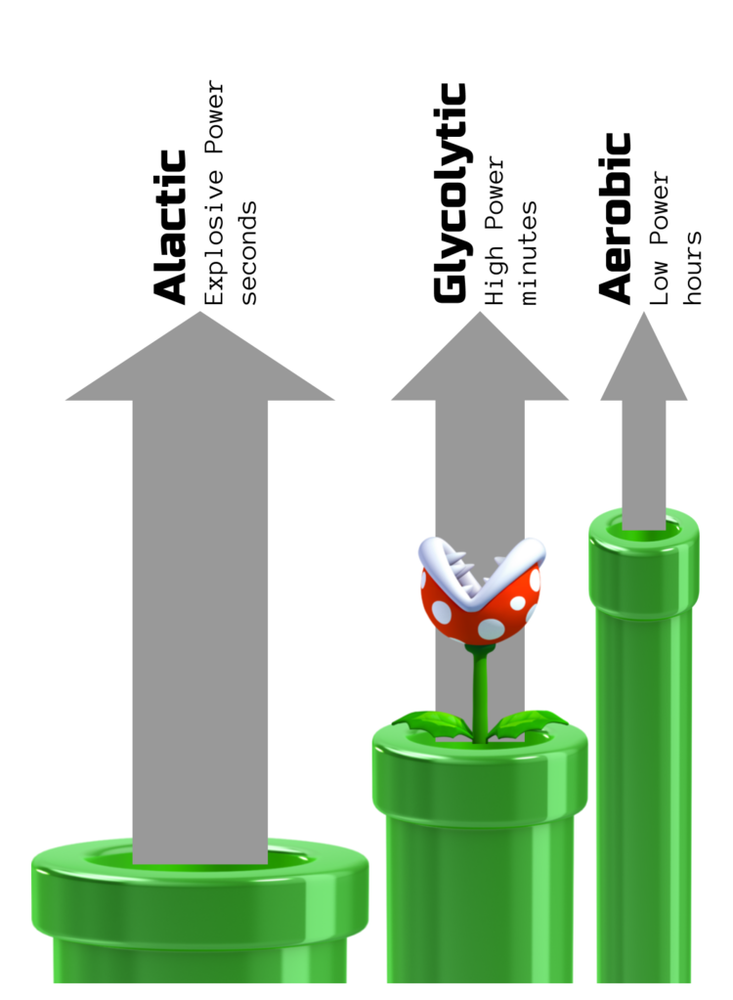

# The Biochemistry of Alactic + Aerobic Work Part 10

I’m done (maybe?) with the Biochemistry of A+A series. It’s been fun digging into what’s happening at the cellular level, and it forced me to read and learn more about what’s going on.

It’s a perfect example of how bottom-up observations drive the understanding better. For years, we’ve seen that the A+A style (even before A+A had a name) of ballistic kettlebell work has been great at training power and endurance - it’s that whole what-the-hell effect. Pavel and others have written numerous books on different ways to incorporate this into your training - It looks like the first book was 1998, so it’s been 20 years of observation and just now we’re getting around to really understanding the why.

But when you look at the sports science, it’s been the other way: top-down reductionist thinking and trying to isolate energy systems and muscle types. All it has produced is an endless sea of treadmills and HIIT classes dotting the landscape and tons of copy-and-paste fitness blogs that say the same thing. Oh, and lots of overweight and out-of-shape people.

What I love about A+A is that it really is a perfect example of the barbell strategy. The name of our gym comes from the core of Antifragility in the financial markets, but it speaks to the survivability of good ideas and rational approaches to life.

We can look at the A+A prescription two ways: what has survived the test of time “experimentally” - long, low-and-slow grinding work plus short, fast ballistics; or what looks like it makes the most sense from the biochemistry - long, low-power work plus short high-power demands periodically.

In the end we get to the same thing, the A+A protocol, which I’ll repeat here:

The key is **repeated bursts of short intense work with lots of rest consistently practiced over weeks or months**.

Let’s break that down…

...bursts of short intense work... - 10 seconds of heavy swings, fast viking push presses, even a few steps of a heavy sled push. We’re getting the most out of the energy we have stored for immediate use.

...lots of rest... - we like to have 4:1 or more rest:work. That gives us enough time to regenerate the ATP so that we can go fast again. The beta-oxidation is refilling our batteries, and that takes time.

...repeated bursts... - we do this for 15 to 30 minutes, sometimes up to an hour. If we do it long enough, we don’t quite recover fully between sets. That means we will need to very lightly tap into glycolysis. We’re training that pathway without over-doing it and causing damages.

...practiced over weeks or months - If you keep coming back, day after day doing these style of workouts. It will tell your body that you need to have more efficient beta-oxidation to fill up your batteries quicker. Since any one mitochondrion cannot supply too much energy at once, your body builds even more mitochondria. You can burn more fat to make more ATP, you’ll have a lot of slow reactions happening in parallel. You’ll get a high power output without stressing your body. Building more mitochondria will let you effortlessly generate ATP quickly - improving your power output.

----

[Home](../index.md) | [Articles](../articles.md)