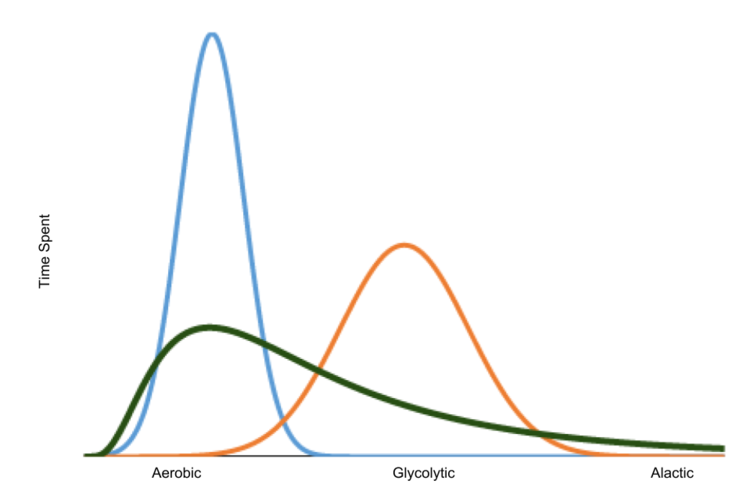
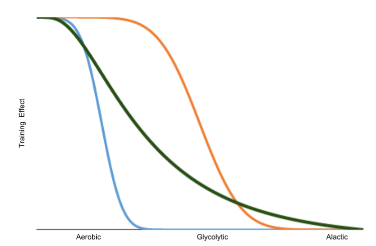

# The Biochemistry of Alactic + Aerobic Work Part 11

I’m still thinking about ways to illustrate how the A+A protocol really does train all three energy systems without over training and causing a huge glycolytic acid load that your body has to recover from.

I have another thought based on where you spend most of your time training and the effects of that training on your body.

Above I have drawn some probability distributions of where different kinds of athletes may spend their tie. The blue line is your typical low-and-slow endurance athlete. Someone who runs or bikes everyday and only does that kind of training. Some days they may go harder, some days they may go easier, but just about every day they are solidly working aerobically only.

The orange line is your typical CrossFitter or other HIIT folks (including all the fancy new studios that are showing up on the 29th street mall - they’re all the same). This kind of athlete does the typical 7-20 minute heavy and fast almost purely glycolytic work every day.

The green line is where the training would fall for a full well-rounded athlete who does the A+A protocol. They would spend their outside-the-gym time doing nice low-and-slow hikes and rucks. Even MAF running would could here. And then they spend a very small amount of time extending into the high power, high intensity work. This would be the A+A Swings, Snatches, or even some grinds and heavy complexes - basically our daily programming.

Now, let’s look what the training effect is on each of the energy systems. Remember, you don’t get to pick what muscle fibers are used. Your body always starts recruiting muscle fibers from the slowest, low-power, aerobic fibers up to the fastest, high-power, alactic fibers. That means, that no matter what you do the most aerobic fibers are always involved - they may not contribute much of the total strength and power output, but they’re always there and getting trained - this is why folks like CrossFit insist that HIIT trains your aerobic output but aerobic output doesn’t train your strength. Taking it farther, this is why A+A trains everything!

Here’s a graph of the cumulative training effect on each pathway. The blue line shows the total time each of the muscle fibers is trained for the athlete who spends most of their time in low-slow work. You can clearly see that the aerobic fibers are trained to the exclusion of all the other pathways. Exactly what we see with a non-strength training endurance athlete.

Now, take a look at the typical HIIT-based glycolytic all the time athlete. Yes, they do train all of their aerobic fibers. That’s good. But you can also see that the time spent engaging the glycolytic fibers is also very high. And it’s that high use of the glycolytic pathway that is the problem. That’s what causes acid build-up and damages your mitochondria. You’ll also see things like adrenal fatigue with these kinds of athlete because the demand for sugar is high (to burn in the glycolytic pathway) and the cortisol helps bring in more sugar. It’s like you’ve become accustomed to burning trash to keep your house warm, and when you run out of trash you find more ways to get trash rather than finding a better way to heat your house.

And now the green line…the A+A protocol has short bursts of very high intensity work, that means that we’re recruiting all of the muscle fibers and needing all off the energy pathways. But, we spend little time up there, we’re not over using any of them. We also dig a little into the gylcolytic pathway so that gets used, but not so much that we’re getting acid build-up. And, what I think is the most interesting, is that the aerobic pathway - particularly the low-and slow pathway is no worse trained with A+A than with pure aerobic training. In some intensity bands, it’s even better trained with A+A.

How do we implement the A+A protocol. Here’s the basic prescription:

A+A training is done with kettlebell ballistic movements (swings and snatches, usually) with a (relatively) heavy weight for up to five (snatches) or ten (swings) reps for many repeats.

Be sure to have plenty of rest between them to be almost fully recovered - begin the next one strong and end it strong also. The principal is simple: build up high quality heavy volume without chasing it with fatigue.

My favorite are snatches, but since they're so technical I usually stick to swings:

**A+A** is **A**lactic Ballistics - lasting around 10 sec + **A**erobic recovery - lasting until you’re ready to go strong again:

Some essential points:

- you must have really solid technique to begin with and willingness to work on quality in every rep, every repeat, every sessions aiming for mastering the movement
- it is not the aim to reduce rest periods over time but rather to let it happen over time
- you will get better without trying to get better, in fact pushing yourself to get better will result in the opposite happening.
- using a HR-monitor is very helpful to get some biofeedback but don't let it control your training session
- pay attention to what your body and breathing sensations feel like - not only from repeat to repeat, but from session to session also, as fatigue accumulates with heavy volume work
- it is more of an aim over time to rely by feel to know when ready again
- it may be an aim also, to help recovery for instance nose breathing only while resting, shaking the limbs out a bit, walking around, breath counting - fast and loose drills
- there should be almost no mental pushing involved - it should be more boring than effortful
- it is not about using the heaviest bell possible - a bell for five reps may be a bell one can swing/snatch around 8-10 strongly
- hand care is very important, keeping callous short and soft using lotion when needed
- one should build up to this kind of volume work - the number of reps in a session sneaks up on you

We do A+A work as a way to get stronger (heavy kettlebells build muscle) and to build your aerobic capacity in a way that doesn’t fatigue you.

My goal is for you to **leave the gym every day feeling better than when you walked in**. And for you to suddenly realize after a few months that everything else you do is easier. **Fitness will sneak up on you.**

